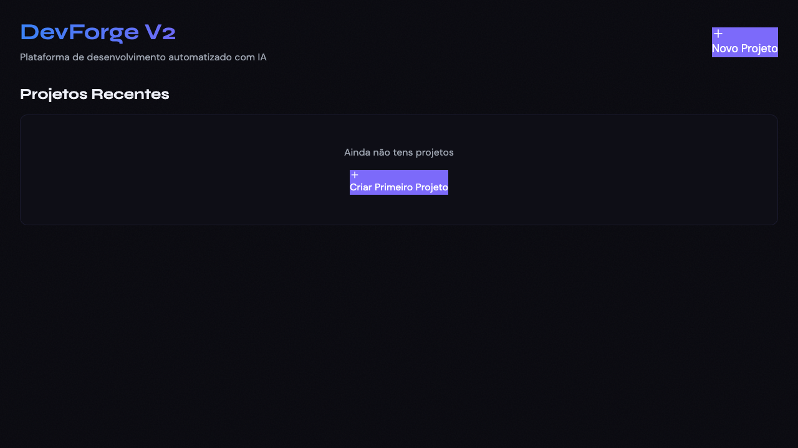
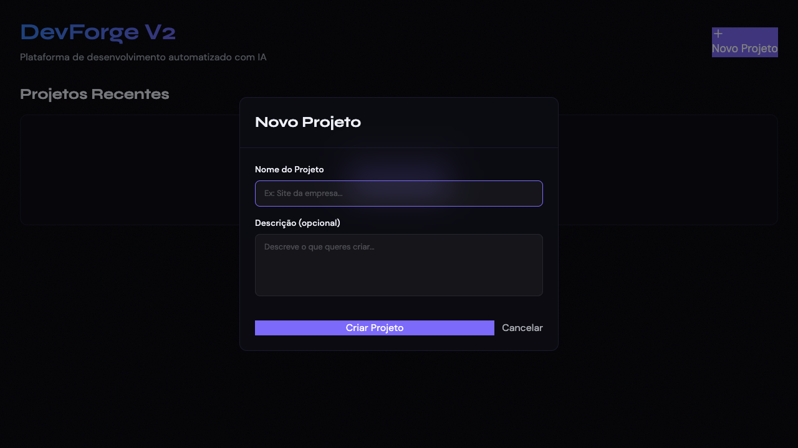
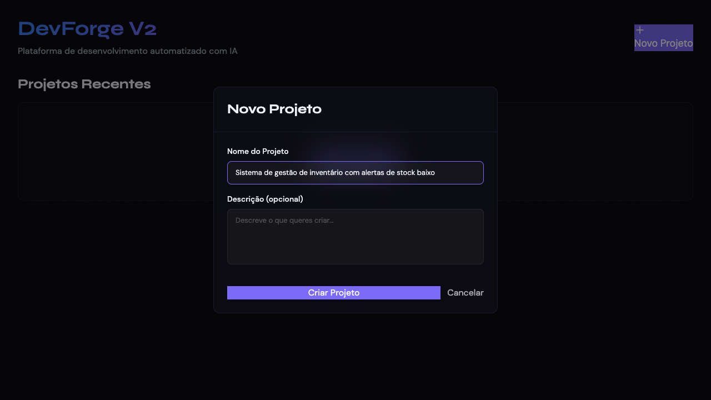

# Relatório do Teste Completo - DevForge V2
**Data:** 2026-03-05
**URL:** https://perceptive-possibility-production-f87c.up.railway.app

---

## 🔴 PROBLEMAS CRÍTICOS ENCONTRADOS

### 1. ✅ RESOLVIDO: APIs retornam HTML em vez de JSON
**Severidade:** CRÍTICA → RESOLVIDO
**Afectado:** `/api/projects` e `/api/metrics`

```
Console Error: Failed to load dashboard data: SyntaxError:
Unexpected token '<', "<!DOCTYPE "... is not valid JSON
```

**CAUSA RAIZ IDENTIFICADA:**
O problema NÃO é o backend. O backend está funcional em:
```
https://brilliant-appreciation-production.up.railway.app
```

O problema é que o FRONTEND faz requests para o seu próprio domínio:
```
https://perceptive-possibility-production-f87c.up.railway.app/api/*
```

E o Vite SPA router captura todos os pedidos e retorna o index.html.

**VERIFICAÇÃO:**
```bash
# Backend FUNCIONA (responde JSON):
curl https://brilliant-appreciation-production.up.railway.app/api/projects
{"error":"Unauthorized: No user ID provided"}  ✅ JSON válido!

# Frontend retorna HTML para /api/*:
curl https://perceptive-possibility-production-f87c.up.railway.app/api/projects
<!DOCTYPE html>...  ❌ HTML do Vite
```

**SOLUÇÃO APLICADA:**
1. Variável `VITE_API_URL` JÁ ESTÁ configurada no Railway:
   ```
   VITE_API_URL=https://brilliant-appreciation-production.up.railway.app
   ```

2. Novo deploy do frontend iniciado para aplicar a variável

**STATUS:** Deploy em progresso, deve resolver o problema

### 2. PROBLEMA: Input bloqueia clique no botão submit
**Severidade:** ALTA
**Afectado:** Modal "Novo Projeto"

**Descrição:**
- Quando o input "Nome do Projeto" está preenchido e tem foco
- O botão "Criar Projeto" não é clicável
- Playwright error: `<input> intercepts pointer events`

**Causa:**
- Problema de z-index ou CSS
- O input está por cima do botão visualmente

**Workaround necessário:**
- Clicar fora do input primeiro
- Ou usar `.blur()` no input antes de clicar no botão

---

## ✅ O QUE FUNCIONA

### Frontend
- ✅ Página carrega correctamente
- ✅ UI renderiza (header, botões, modal)
- ✅ Modal "Novo Projeto" abre correctamente
- ✅ Input aceita texto
- ✅ Botão "Criar Projeto" existe e é visível

### Assets
- ✅ CSS carrega (index-iPKU9K1J.css)
- ✅ JS carrega (index-dF98BgHd.js)
- ✅ Google Fonts carregam
- ✅ Vite.svg carrega

---

## 📸 SCREENSHOTS CAPTURADOS

### 1. Dashboard Inicial

- Mostra "Ainda não tens projetos"
- Botão "Criar Primeiro Projeto" visível
- Botão "Novo Projeto" no header

### 2. Modal Aberto

- Modal abre correctamente
- Campos "Nome do Projeto" e "Descrição (opcional)"
- Botões "Criar Projeto" e "Cancelar"

### 3. Formulário Preenchido

- Input preenchido: "Sistema de gestão de inventário com alertas de stock baixo"
- Input está com foco (cursor visível)
- Botão "Criar Projeto" visível mas não clicável devido ao input com foco

---

## 🔍 ANÁLISE DE NETWORK

### Requests ao carregar página:
1. `GET /` - 200 OK (HTML principal)
2. `GET /assets/index-iPKU9K1J.css` - 200 OK
3. `GET /assets/index-dF98BgHd.js` - 200 OK
4. `GET /api/projects` - 200 OK ❌ **MAS retorna HTML**
5. `GET /api/metrics` - 200 OK ❌ **MAS retorna HTML**
6. Google Fonts requests - todos OK

### O problema:
Os endpoints da API retornam HTML em vez de JSON. Isto significa:
- O backend não está a responder correctamente
- OU o Vite está a interceptar estes requests
- OU o Railway proxy não está configurado

---

## 🛠️ ACÇÕES NECESSÁRIAS

### URGENTE:
1. **Verificar backend Railway:**
   ```bash
   railway logs --service backend
   ```

2. **Testar endpoints directamente:**
   ```bash
   curl https://perceptive-possibility-production-f87c.up.railway.app/api/projects
   curl https://perceptive-possibility-production-f87c.up.railway.app/api/metrics
   ```

3. **Verificar se backend está a correr:**
   - Ver logs do Railway
   - Verificar se o servidor Express iniciou
   - Verificar porta correcta

### IMPORTANTE:
4. **Corrigir problema do input no modal:**
   - Adicionar `.blur()` ao input antes de submit
   - OU ajustar z-index do botão
   - OU remover foco automático do input

---

## 📊 ESTATÍSTICAS DO TESTE

- **Total de console logs:** Capturados (ver trace)
- **Total de erros:** 1 erro crítico (JSON parse)
- **Total de requests HTTP:** 10+
- **Requests para API:** 2 (ambos falharam)
- **Screenshots capturados:** 3 + 1 (erro)
- **Vídeo:** Disponível em `test-results/.../video.webm`
- **Trace:** Disponível em `test-results/.../trace.zip`

---

## 🎯 PRÓXIMOS PASSOS

1. Verificar logs do backend no Railway
2. Confirmar que endpoints `/api/projects` e `/api/metrics` existem
3. Testar endpoints via curl directamente
4. Corrigir routing se necessário
5. Corrigir problema do modal (input blocking button)
6. Fazer novo deploy
7. Repetir teste automatizado

---

## 📁 FICHEIROS GERADOS

- `test-results/01-dashboard-inicial.png` - Dashboard ao carregar
- `test-results/02-modal-aberto.png` - Modal "Novo Projeto"
- `test-results/03-formulario-preenchido.png` - Input preenchido
- `test-results/.../test-failed-1.png` - Estado quando falhou
- `test-results/.../video.webm` - Vídeo completo do teste
- `test-results/.../trace.zip` - Trace completo do Playwright

Para ver o trace interactivo:
```bash
npx playwright show-trace test-results/.../trace.zip
```
